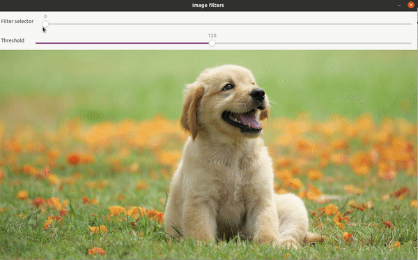

# Image Filters

This repo contains a program which can apply different filters to an image. The image can be specify or the webcam can be selected. The implemented image filters are:
* Gray scale
* Pencil Sketch
* Cartoonify

## Dependencies for Running Locally

* cmake >= 2.8
  * All OSes: [click here for installation instructions](https://cmake.org/install/)
* make >= 4.1 (Linux, Mac), 3.81 (Windows)
  * Linux: make is installed by default on most Linux distros
  * Mac: [install Xcode command line tools to get make](https://developer.apple.com/xcode/features/)
  * Windows: [Click here for installation instructions](http://gnuwin32.sourceforge.net/packages/make.htm)
* OpenCV >= 4.1
  * The OpenCV 4.1.0 source code can be found [here](https://github.com/opencv/opencv/tree/4.1.0)
* gcc/g++ >= 5.4
  * Linux: gcc / g++ is installed by default on most Linux distros
  * Mac: same deal as make - [install Xcode command line tools](https://developer.apple.com/xcode/features/)
  * Windows: recommend using [MinGW](http://www.mingw.org/)

## Basic Build Instructions

1. Clone this repo
2. Make a build directory in the top level directory: `mkdir build && cd build`
3. Compile: `cmake .. && make`
4. Run it: `./imageFilters <option>`

`<option>` can be:
* `default`: The program opens an example image to test filters
* `webcam`: Initialize the webcam to apply filters in real time
* `<imagePath>`: The user can indicate a path to a custom image

## Rubric

The following points have been addressed in the rubric:

### README

| Criteria | Meets specifications | Comments |
| -------- | -------------------- | -------- |
| A README with instructions is included with the project | The README is included with the project and has instructions for building/running the project.     If any additional libraries are needed to run the project, these are indicated with cross-platform installation instructions.                                                      You can submit your writeup as markdown or pdf |

